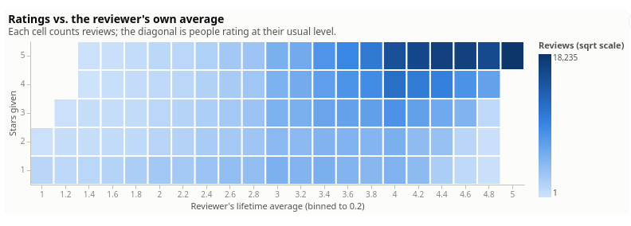

# Amazon Product Review Analysis (SQL)

A SQL-focused analysis of 194,439 Amazon reviews (Cell Phones & Accessories,
2001–2014), built to practice window functions and CTEs. Five analytical queries,
each rendered as an interactive chart with commentary.

**Read the report: <https://beaverdam2026.github.io/product-review-analysis/>**




## Questions

Each analysis question is one query in [`sql/`](sql/)

| Query | Question |
| --- | --- |
| [`rating_vs_reviewer_avg.sql`](sql/rating_vs_reviewer_avg.sql) | How closely do people rate near their own lifetime average? |
| [`product_trajectory.sql`](sql/product_trajectory.sql) | How do ratings of the most-reviewed products move over time? |
| [`reviewer_summary.sql`](sql/reviewer_summary.sql) | How active are reviewers, and do prolific ones rate differently? |
| [`product_summary.sql`](sql/product_summary.sql) | What does the rating-vs-popularity landscape look like? |
| [`most_helpful_reviews.sql`](sql/most_helpful_reviews.sql) | What kind of review gets voted most helpful? |

## Key findings

- Reviews skew very positive: the average reviewer rates ~4 stars, and ~75%
  of reviews land within one star of the reviewer's own lifetime average.
- Reviewer activity is very bottom heavy: >90% of reviewers wrote <10 reviews
  reviews. The most active wrote 149.
- Popularity implies quality: no product with 30+ reviews averages
  <=2 stars, and the 2% of products with >100 reviews hold 21% of all
  reviews.
- Established products are stable: the 30 most-reviewed products
  do not see much fluctuation in average rating, and their running averages
  are all between 3 and 5 stars.
- Critical reviews (1/2 stars) make up a smaller share of "most helpful" reviews
  as vote counts climb: ~17% at 5–9 votes down to ~8% at 100+.

The full narrative is in [the report.](https://beaverdam2026.github.io/product-review-analysis/).

## Repository structure

- `sql/` — one `.sql` file per question, plus `schema.sql` (DDL) and
  `data_profiling.sql` (integrity checks)
- `scripts/` — JSON → SQLite loaders and `queries.py`, the one place a
  `.sql` file becomes a pandas DataFrame
- `report.qmd` — the report source; renders to `docs/index.html` (served by
  GitHub Pages)
- `_quarto.yml` — render configuration

## Reproducing

Requires [uv](https://docs.astral.sh/uv/), [Quarto](https://quarto.org), and sqlite.
The data files are not committed; download both into `data/`:

- Reviews (`Cell_Phones_and_Accessories_5.json`): from the
  [Kaggle re-upload](https://www.kaggle.com/datasets/abdallahwagih/amazon-reviews).
- Metadata (`meta_Cell_Phones_and_Accessories.json.gz`): from the
  [original dataset page](https://cseweb.ucsd.edu/~jmcauley/datasets/amazon/links.html)
  ([direct download](https://snap.stanford.edu/data/amazon/productGraph/categoryFiles/meta_Cell_Phones_and_Accessories.json.gz),
  ~94 MB — leave it gzipped; the loader reads the `.json.gz` directly).

```bash
uv sync                                  # python env, pinned by uv.lock
uv run python scripts/load_data.py       # build data/reviews.db
uv run python scripts/load_metadata.py   # add product titles
sqlite3 data/reviews.db < sql/product_summary.sql   # run any single query
uv run quarto render                     # rebuild docs/index.html
```

## AI usage

This project was built with AI assistance (Claude Code), with a deliberate
division of labor:

- **Written by hand:** every analytical query in `sql/` (the window
  functions, CTEs, and binning logic that are the point of the project),
  Altair chart detailing, and the vast majority of report writing
- **AI-assisted:** project scaffolding (environment, data loaders, the
  Quarto/GitHub Pages pipeline, Altair chart outlines), SQL syntax review

## Data

Data: the Cell Phones & Accessories 5-core subset of the Amazon review dataset
(McAuley et al.) — every reviewer and every product has at least 5 reviews.
Citation: J. McAuley, C. Targett, J. Shi, A. van den Hengel.
"Image-based recommendations on styles and substitutes." SIGIR, 2015.

## License

Code in this repository is MIT-licensed — see [LICENSE](LICENSE).

The review data is not distributed with this repository. The reviews file
comes from a [Kaggle re-upload](https://www.kaggle.com/datasets/abdallahwagih/amazon-reviews)
published under the Apache 2.0 license; the dataset citation is in
[Data](#data) above.